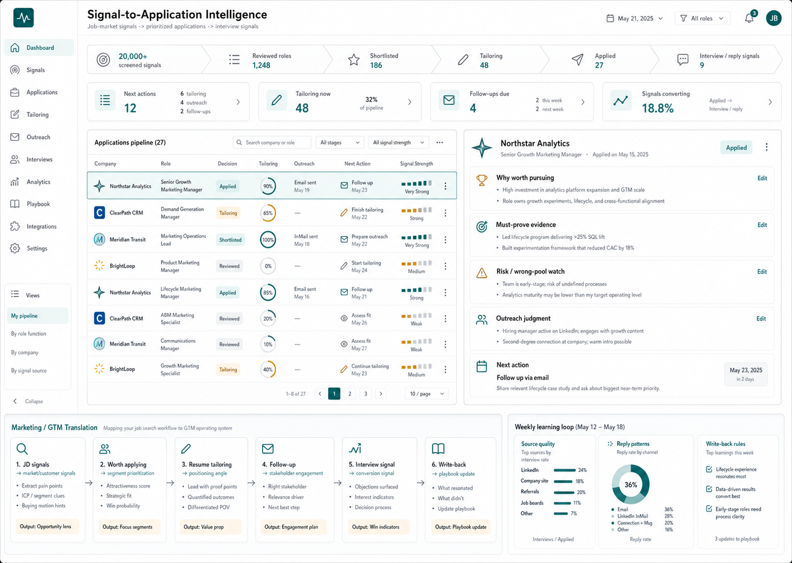

# HM-Facing Application Tracker: From Job Search To Marketing Analysis

Status: HM-facing system story  
Scope: Application Tracker narrative, demo framing, and Marketing / GTM translation  
Last reviewed: 2026-06-16

## 一句話

Job Application Tracker 讓你知道哪一份申請值得投、哪一份正在客製、
哪一份已送出、哪一位人脈要 follow up、哪些 input 開始轉成面試訊號。

好的 tracker 不是把求職變複雜，而是讓你不用靠焦慮和記憶管理求職。
它把一個原本靠記憶、情緒、臨場反應推進的流程，整理成一條可以被檢查、
可以被追蹤、也可以被改進的 pipeline。

所以這個系統不只是普通 tracker。它是一個 job-market
signal-to-decision system：大量職缺訊號進來，經過判斷規則、AI 協助、
人工 checkpoint、客製產出、follow-up 與結果回寫，最後變成下一輪更好的
判斷基線。

我不是展示一個求職 tracker；我是展示一個把人的判斷變成可重跑 workflow
的 live case。

## 這套系統真正證明什麼

這套系統真正證明的不是「我會用 AI 做履歷」，也不是「我有一個資料庫」。
它證明的是：我能把大量混亂訊號整理成有規則的下一步，而且這個規則不是
憑空長出來的，是從真實求職判斷、踩坑、修正與回寫裡慢慢長出來的。

Hiring Manager 看這個系統時，應該看到四件事：

1. 我能處理大量 noisy signals，不是被資訊淹沒。
2. 我能把人的判斷拆成規則，而不是每次重新靠感覺。
3. 我能讓 AI 跑量，但標準、風險邊界與 checkpoint 仍然由人定義。
4. 我能把結果回寫成下一輪更好的 workflow，而不是只修正單次輸出。

AI 不是替我亂做決定，而是把我反覆講出來的判斷邏輯，沉澱成可以重複
執行、可以檢查、可以回寫修正的 workflow。

這個系統 scales judgment, not blind activity. 它放大的不是「投更多」，
而是「更穩定地判斷什麼值得投、怎麼投、投完之後怎麼追、結果回來後怎麼學」。

## 架構：不是 DB，是 Job Search Operating System

這個專案不要被講成「我的 DB」。DB 不是產品名，它是可信度裝置。

比較準確的架構說法是：

| 層 | 對 HM 的人話說法 | 它真正負責什麼 |
|---|---|---|
| Job-search operating system | 我的後端 workflow engine | Claude Code / Codex、skills、commands、repo rules 與人工判斷流程 |
| Supabase / DB | 可信狀態層 | 記錄哪些角色進入 pipeline、目前在哪一步、哪些狀態已被確認 |
| Blazor / Telerik cockpit | HM-facing inspection surface | 把判斷、狀態、下一步與 evidence 用可檢查的方式展示出來 |

前臺不是要展示所有資料，而是要讓 HM 感受到這套系統可以被檢查、可以被
信任、可以被轉移。它的任務不是把資料庫攤開，而是回答：

- 哪些 role 真的值得投入？
- 哪些 application 正在客製？
- 哪些已經送出？
- 哪些人脈需要 follow up？
- 哪些 input 開始轉成 interview signal？
- 哪些結果要回寫成下一輪更好的規則？

前臺要讓 HM 看到：我如何把人的經驗變成可重跑的判斷系統。

## 為什麼這對 Marketing Analysis 有感

這其實就是 Marketing Analysis 的 live case，只是分析對象不是 customer，
而是 job market。

Marketing Analysis 本質上也不是只做 dashboard。好的 marketing analysis
是在處理一條 signal-to-action pipeline：很多市場、客戶、campaign、CRM、
sales、BD 訊號進來，分析者要判斷哪個訊號重要、哪個只是 noise、哪個 segment
值得追、哪個 message angle 要調整、哪個 follow-up 代表真正的 engagement。

Application Tracker 對應到 Marketing / GTM / Customer Signal Analytics
可以這樣翻譯：

| 求職系統裡發生的事 | Marketing / GTM 對應 |
|---|---|
| 大量 JD volume | market / customer / campaign / revenue / BD signals |
| 判斷哪份值得投 | 判斷哪個 segment、account、lead 或 opportunity 值得追 |
| Resume tailoring | positioning、message angle、proof selection |
| Networking follow-up | stakeholder engagement、relationship pipeline |
| Interview signal | conversion、reply、engagement 或 buying-signal proxy |
| Skill write-back | playbook、scoring rule、operating logic update |
| Weekly review | source quality、conversion pattern、message learning loop |

所以求職只是我用真資料驗證它的垂直場景。對 GTM HM 來說，它翻譯成：

```text
messy market/customer signals
-> structured decision context
-> human-reviewed next action
-> write-back learning loop
```

這就是我想呈現的 Marketing Analysis 能力：不是單純把資料畫成圖，而是把
scattered signals 變成可追蹤、可交接、可改善的 decision support。

## HM 看這個時應該感覺到什麼

HM 在意的不是工具炫技。他們在意的是：這個人進來之後，能不能讓團隊少一點
混亂、多一點可判斷的下一步。

看完這個 tracker，HM 應該感覺到：

- 她能把混亂訊號變成可執行的下一步。
- 她知道 AI 應該在哪裡跑量，也知道 AI 應該在哪裡停下來讓人 review。
- 她不是 AI spam operator；她會保留 human checkpoint。
- 她能留下可交接、可追蹤、可改善的工作系統。
- 她能把同一套方法用在 customer、campaign、CRM、GTM pipeline。

可以直接用的英文說法：

> I use AI to convert repeated human judgment into reusable operating rules.

> The system scales judgment, not blind activity.

> This started as a live job-search system, but the pattern is the same in
> GTM work: messy signals become structured context, reviewed next actions,
> and a learning loop that improves the next run.

這些句子比「我會做 AI workflow」更有感，因為它們把能力翻成 HM care about
的工作結果：更乾淨的訊號、更清楚的優先順序、更可信的 handoff、更穩定的
follow-up。

## 三分鐘 Demo 故事

這個 demo 不應該從技術架構開始。HM 第一時間不需要知道每個 skill 怎麼叫、
每個資料表怎麼設計。他們需要先看到：這套系統怎麼把混亂的求職市場變成一條
可治理的 pipeline。

三分鐘展示可以照這個順序走：

1. 先看 funnel：大量 JD 如何被收斂。
   - 「這裡不是在追求投越多越好，而是在看哪些 role 真的值得進入 pipeline。」
   - 這一步對應到 GTM 裡的 source quality、lead quality、segment quality。

2. 點一份 application：為什麼值得投。
   - 展示 role 的重點、fit reasoning、風險、下一步。
   - 重點不是「我喜歡這份工作」，而是「這個判斷有 evidence、有邊界、有 next action」。

3. 看 tailoring：如何把 JD 轉成證據與定位。
   - 展示 resume / cover letter / memo 的狀態，而不是只展示文字成品。
   - 說明每份客製不是複製貼上 JD，而是把 role need 轉成 candidate proof。

4. 看 outreach：不是亂發訊息，而是依 stakeholder 判斷。
   - 展示哪位 contact 要 follow up、為什麼是這個人、這個 touch 的目標是什麼。
   - 對 GTM HM 來說，這是 stakeholder engagement discipline。

5. 看 follow-up / interview signal：哪些 input 開始轉成結果。
   - 展示 reply、referral、interview、rejection、silence 如何被追蹤。
   - 重點是這些不是零散事件，而是 pipeline signal。

6. 看 write-back：結果如何更新下一輪規則。
   - 哪些 source 值得加權？
   - 哪些 role type 其實 wrong pool？
   - 哪種 message pattern 會轉成 reply？
   - 哪些 resume angle 需要收斂或調整？

這個 demo 的原則是：不展示內部 skill 名稱，改成工作語言。不要說「我跑了某某
skill」，要說「這一步會先判斷 role pool、風險、must-prove evidence，才進入
tailoring」。HM 要聽見的是工作品質，不是內部工具名。

## 對外說法與誠實邊界

這個系統很有力，但對外要守誠實邊界。強的故事不需要 overclaim。

可以說：

- AI screened 20,000+ opportunities under rules I defined and reviewed.
- This is a live job-search system translated to GTM use cases.
- The workflow uses AI for volume, structure, and drafting, with human review
  before important decisions or record updates.
- The same pattern applies to customer, campaign, CRM, and revenue signals:
  structure the signal, review the next action, write back the learning.

不要說：

- 我人工讀了 20,000+ JD。
- 這是 production customer marketing data。
- 這代表我 already owned a production CRM or GTM system。
- AI 自動決定要投哪份、要寫什麼、要聯絡誰。

AI 是方法層，不是主身份。主身份仍然是 Marketing / GTM / Customer Signal
Analytics：把 market、customer、campaign、revenue、BD 的雜亂訊號整理成
清楚報表、商業建議、可交接流程與可學習的 decision support。

## 第一屏應該怎麼設計

第一屏不是 landing page，也不是資料庫總表。第一屏要讓 HM 不是覺得「這人
做了一個 dashboard」，而是覺得「這人知道怎麼把混亂工作變成可治理的 pipeline」。



這張雛型圖是第一屏的視覺方向：上方用 funnel 告訴 HM 大量訊號如何被收斂，
中間用 application grid 和 decision detail 顯示每份申請背後的判斷，下方把
求職 pipeline 翻譯成 Marketing / GTM pipeline，讓讀者立刻看懂這套方法可以
轉移到 customer、campaign、CRM、GTM signals。

可開啟的靜態 HTML prototype：[`prototypes/signal-to-application-intelligence-static.html`](prototypes/signal-to-application-intelligence-static.html)。
這份 HTML 使用 live DB 欄位與代表性資料做靜態模擬，但不包含連線字串或 live
API 呼叫。

建議第一屏放六個訊號：

1. Signal funnel
   - 顯示大量 JD 如何被篩選、收斂、進入 application pipeline。
   - 讓 HM 看到 volume handling 和 prioritization。

2. Today's next actions
   - 哪些 role 要 review？
   - 哪些 application 要 tailor？
   - 哪些已經 ready to submit？
   - 哪些 follow-up due？

3. Role decision evidence
   - 每個 role 為什麼值得投、風險在哪、下一步是什麼。
   - 不讓狀態只是 badge，而要讓狀態背後有判斷。

4. Tailoring / outreach state
   - Resume、cover letter、application、networking、follow-up 都要變成 workflow state。
   - 不要讓這些東西藏在一段模糊 note 裡。

5. Follow-up queue
   - 讓人一眼知道哪位 contact、哪份 application、哪個 touch 需要下一步。
   - 這是避免求職靠焦慮和記憶管理的關鍵。

6. Learning write-back loop
   - 哪些 input 轉成 interview signal？
   - 哪些 source、role type、message pattern 需要調整？
   - 哪些判斷應該寫回下一輪規則？

如果第一屏做對，HM 會看到的不是一個漂亮頁面，而是一種工作方法：把大量訊號
變成結構，把結構變成判斷，把判斷變成行動，再把行動結果寫回下一輪更好的
系統。
